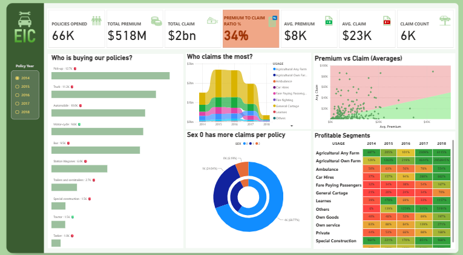

# 📊 EIC Insurance Analytics Dashboard

## 📌 Project Overview
This repository contains a comprehensive Power BI dashboard developed to analyze insurance policy distribution, claim behaviors, and segment profitability for **EIC** over a 5-year period (2014–2018). The core objective is to minimize financial risk and highlight the most lucrative policy categories.

## 📷 Dashboard Preview

## ⚡ Core KPIs Tracked
* **Policies Opened:** 66K
* **Total Premium:** $518M
* **Total Claim:** $2 Billion
* **Premium to Claim Ratio:** 34%
* **Avg. Premium vs. Avg. Claim:** $8K vs. $23K
* **Total Claim Count:** 6K

## 🔑 Key Features & Analytical Insights
* **Demographic Breakdown:** Visualizes "Who is buying our policies?" by vehicle type and sex demographics.
* **Claim Volume Trends:** A stacked area chart detailing "Who claims the most?" grouped by vehicle usage types across time.
* **Risk Assessment:** A quadrant scatter plot mapping Average Premium against Average Claim to pinpoint high-risk outliers.
* **Profitability Matrix:** A conditional-formatted heat map matrix breaking down growth percentages across years for distinct usage segments.

## 🛠️ Tech Stack & Skills Used
* **Power BI Desktop:** Dashboard design, data mashup, and visual configurations.
* **Power Query:** Data cleaning, type transformations, and schema optimization.
* **DAX (Data Analysis Expressions):** Formulated custom calculated measures for ratios, running totals, and averages.
